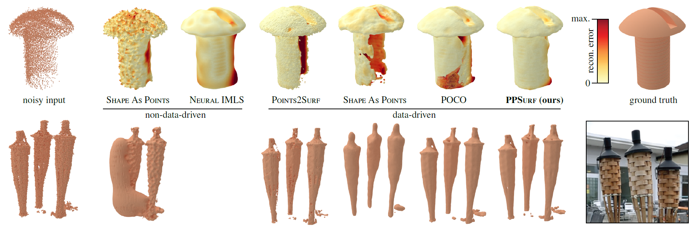

# PPSurf
Combining Patches and Point Convolutions for Detailed Surface Reconstruction

This is our implementation of [PPSurf](https://www.cg.tuwien.ac.at/research/publications/2024/erler_2024_ppsurf/),
a network that estimates a signed distance function from point clouds. This SDF is turned into a mesh with Marching Cubes.



This is our follow-up work for [Points2Surf](https://www.cg.tuwien.ac.at/research/publications/2020/erler-p2s/).
It uses parts of [POCO](https://github.com/valeoai/POCO), mainly the network and mesh extraction.
This work was published in [Computer Graphics Forum (Jan 2024)](https://onlinelibrary.wiley.com/doi/10.1111/cgf.15000).


## Setup

We tested this repository on these systems:
* Windows 10/11 and Ubuntu 22.04 LTS
* CUDA 11.7, 11.8 and 12.1

To manage the Python environments, we recommend using [Micromamba](https://github.com/mamba-org/mamba), 
a much faster Anaconda alternative. 
To install it, [follow this guide](https://mamba.readthedocs.io/en/latest/micromamba-installation.html#umamba-install). 

Alternatively, you can install the required packages with conda by simply replacing the 'mamba' calls with 'conda'.
Finally, you can use Pip with the requirements.txt.

``` bash
# clone this repo, a minimal dataset is included
git clone https://github.com/ErlerPhilipp/ppsurf.git

# go into the cloned dir
cd ppsurf

# create the environment with the required packages
mamba env create --file pps{_win}.yml

# activate the new environment
mamba activate pps
```
Use `pps_win.yml` for Windows and `pps.yml` for other OS.

Test the setup with the minimal dataset included in the repo:
``` bash
python full_run_pps_mini.py
```

## Datasets, Model and Results

Datesets:
``` bash
# download the ABC training and validation set
python datasets/download_abc_training.py

# download the test datasets
python datasets/download_testsets.py
```

Model:
``` bash
python models/download_ppsurf_50nn.py
```
Let us know in case you need the other models from the ablation. 
They were trained using old, unclean code and are not directly compatible with this repo. 

Results:

Download the results used for the paper from [here](https://www.cg.tuwien.ac.at/research/publications/2024/erler_2024_ppsurf/).
This includes meshes and metrics for the 50NN variant.

## Reconstruct single Point Clouds

After the setup, you can reconstruct a point cloud with this simple command:
``` bash
python pps.py rec {in_file} {out_dir} {extra params}

# example
python pps.py rec "datasets/abc_minimal/04_pts_vis/00010009_d97409455fa543b3a224250f_trimesh_000.xyz.ply" "results/my clouds/" --model.init_args.gen_resolution_global 129
```
Where *in_file* is the path to the point cloud and *out_dir* is the path to the output directory.  
This will download our pre-trained 50NN model if necessary and reconstruct the point cloud with it.    
You can append additional parameters as described in [Command Line Interface Section](#Command-Line-Interface).  

*rec* is actually not a sub-command but is converted to *predict* with the default parameters before parsing. 
You can use the *predict* sub-command directly for more control over the reconstruction:
``` bash
python pps.py predict -c configs/poco.yaml -c configs/ppsurf.yaml -c configs/ppsurf_50nn.yaml \
  --ckpt_path models/ppsurf_50nn/version_0/checkpoints/last.ckpt --trainer.logger False --trainer.devices 1 \
  --data.init_args.in_file {in_file} --model.init_args.results_dir {out_dir}
```

Using the *predict* sub-command will **not** download our pre-trained model. You can download it manually:
``` bash
python models/download_ppsurf_50nn.py
```

Supported file formats are:
- PLY, STL, OBJ and other mesh files loaded by [trimesh](https://github.com/mikedh/trimesh).  
- XYZ as whitespace-separated text file, read by [NumPy](https://numpy.org/doc/stable/reference/generated/numpy.loadtxt.html). 
Load first 3 columns as XYZ coordinates. All other columns will be ignored.
- NPY and NPZ, read by [NumPy](https://numpy.org/doc/stable/reference/generated/numpy.load.html).
NPZ assumes default key='arr_0'. All columns after the first 3 columns will be ignored.
- LAS and LAZ (version 1.0-1.4), COPC and CRS loaded by [Laspy](https://github.com/laspy/laspy). 
You may want to sub-sample large point clouds to ~250k points to avoid speed and memory issues.
For detailed reconstruction, you'll need to extract parts of large point clouds.


## Replicate Results

Train, reconstruct and evaluate to replicate the main results (PPSurf 50NN) from the paper
``` bash
python full_run_pps.py
```

Training takes about 5 hours on 4 A40 GPUs. By default, training will use all available GPUs and CPUs.
Reconstructing one object takes about 1 minute on a single A40. The test sets have almost 1000 objects in total. 

Logging during training with Tensorboard is enabled by default. 
We log the loss, accuracy, recall and F1 score for the sign prediction. 
You can start a Tensorboard server with: 
``` bash
tensorboard --logdir models
```


## Command Line Interface

PPSurf uses the Pytorch-Lightning [CLI](https://lightning.ai/docs/pytorch/stable/cli/lightning_cli.html).
The basic structure is:
``` bash
# CLI command template 
python {CLI entry point} {sub-command} {configs} {extra params}
```
Where the *CLI entry point* is either `pps.py` or `poco.py` and *sub-command* can be one of *[fit, test, predict]*.  
*Fit* trains a model, *test* evaluates it and *predict* reconstructs a whole dataset or a single point cloud.

*Configs* can be any number of YAML files. Later ones override values from earlier ones. 
This example adapts the default POCO parameters to PPSurf needs and uses all GPUs of our training server:
``` bash
-c configs/poco.yaml -c configs/ppsurf.yaml -c configs/device_server.yaml
```

You can override any available parameter explicitly:
``` bash
--model.init_args.gen_resolution_global 129 --debug True
```

When running *test*, *predict* or *rec*, you need to consider a few more things.
Make sure to specify the model checkpoint! 
Also, you need to specify a dataset, since the default is the training set.
Finally, you should disable the logger, or it will create empty folders and logs. 
``` bash
--ckpt_path 'models/{name}/version_{version}/checkpoints/last.ckpt' --data.init_args.in_file 'datasets/abc_minimal/testset.txt' --trainer.logger False
```
where *name* is e.g. ppsurf and *version* is usually 0. 
If you run the training multiple times, you need to increment the version number.

Appending this will print the assembled config without running anything:
``` bash
--print_config
```

These are the commands called by full_run_pps.py to reproduce our results *PPSurf 50 NN*:
``` bash
# train
python pps.py fit -c configs/poco.yaml -c configs/ppsurf.yaml -c configs/device_server.yaml -c configs/ppsurf_50nn.yaml

# test
python pps.py test -c configs/poco.yaml -c configs/ppsurf.yaml -c configs/ppsurf_50nn.yaml \
  --data.init_args.in_file datasets/abc/testset.txt --ckpt_path models/ppsurf_50nn/version_0/checkpoints/last.ckpt \
  --trainer.logger False --trainer.devices 1

# predict all ABC datasets
python pps.py predict -c configs/poco.yaml -c configs/ppsurf.yaml -c configs/ppsurf_50nn.yaml \
  --data.init_args.in_file datasets/abc/testset.txt --ckpt_path models/ppsurf_50nn/version_0/checkpoints/last.ckpt \
  --trainer.logger False --trainer.devices 1
python pps.py predict -c configs/poco.yaml -c configs/ppsurf.yaml -c configs/ppsurf_50nn.yaml \
  --data.init_args.in_file datasets/abc_extra_noisy/testset.txt --ckpt_path models/ppsurf_50nn/version_0/checkpoints/last.ckpt \
  --trainer.logger False --trainer.devices 1
python pps.py predict -c configs/poco.yaml -c configs/ppsurf.yaml -c configs/ppsurf_50nn.yaml \
  --data.init_args.in_file datasets/abc_noisefree/testset.txt --ckpt_path models/ppsurf_50nn/version_0/checkpoints/last.ckpt \
  --trainer.logger False --trainer.devices 1

# predict all Famous datasets
python pps.py predict -c configs/poco.yaml -c configs/ppsurf.yaml -c configs/ppsurf_50nn.yaml \
  --data.init_args.in_file datasets/famous_original/testset.txt --ckpt_path models/ppsurf_50nn/version_0/checkpoints/last.ckpt \
  --trainer.logger False --trainer.devices 1
python pps.py predict -c configs/poco.yaml -c configs/ppsurf.yaml -c configs/ppsurf_50nn.yaml \
  --data.init_args.in_file datasets/famous_noisefree/testset.txt --ckpt_path models/ppsurf_50nn/version_0/checkpoints/last.ckpt \
  --trainer.logger False --trainer.devices 1
python pps.py predict -c configs/poco.yaml -c configs/ppsurf.yaml -c configs/ppsurf_50nn.yaml \
  --data.init_args.in_file datasets/famous_sparse/testset.txt --ckpt_path models/ppsurf_50nn/version_0/checkpoints/last.ckpt \
  --trainer.logger False --trainer.devices 1
python pps.py predict -c configs/poco.yaml -c configs/ppsurf.yaml -c configs/ppsurf_50nn.yaml \
  --data.init_args.in_file datasets/famous_dense/testset.txt --ckpt_path models/ppsurf_50nn/version_0/checkpoints/last.ckpt \
  --trainer.logger False --trainer.devices 1
python pps.py predict -c configs/poco.yaml -c configs/ppsurf.yaml -c configs/ppsurf_50nn.yaml \
  --data.init_args.in_file datasets/famous_extra_noisy/testset.txt --ckpt_path models/ppsurf_50nn/version_0/checkpoints/last.ckpt \
  --trainer.logger False --trainer.devices 1

# predict all Thingi10k datasets
python pps.py predict -c configs/poco.yaml -c configs/ppsurf.yaml -c configs/ppsurf_50nn.yaml \
  --data.init_args.in_file datasets/thingi10k_scans_original/testset.txt --ckpt_path models/ppsurf_50nn/version_0/checkpoints/last.ckpt \
  --trainer.logger False --trainer.devices 1
python pps.py predict -c configs/poco.yaml -c configs/ppsurf.yaml -c configs/ppsurf_50nn.yaml \
  --data.init_args.in_file datasets/thingi10k_scans_noisefree/testset.txt --ckpt_path models/ppsurf_50nn/version_0/checkpoints/last.ckpt \
  --trainer.logger False --trainer.devices 1
python pps.py predict -c configs/poco.yaml -c configs/ppsurf.yaml -c configs/ppsurf_50nn.yaml \
  --data.init_args.in_file datasets/thingi10k_scans_sparse/testset.txt --ckpt_path models/ppsurf_50nn/version_0/checkpoints/last.ckpt \
  --trainer.logger False --trainer.devices 1
python pps.py predict -c configs/poco.yaml -c configs/ppsurf.yaml -c configs/ppsurf_50nn.yaml \
  --data.init_args.in_file datasets/thingi10k_scans_dense/testset.txt --ckpt_path models/ppsurf_50nn/version_0/checkpoints/last.ckpt \
  --trainer.logger False --trainer.devices 1
python pps.py predict -c configs/poco.yaml -c configs/ppsurf.yaml -c configs/ppsurf_50nn.yaml \
  --data.init_args.in_file datasets/thingi10k_scans_extra_noisy/testset.txt --ckpt_path models/ppsurf_50nn/version_0/checkpoints/last.ckpt \
  --trainer.logger False --trainer.devices 1
  
# predict the real-world dataset
python pps.py predict -c configs/poco.yaml -c configs/ppsurf.yaml -c configs/ppsurf_50nn.yaml \
  --data.init_args.in_file datasets/real_world/testset.txt --ckpt_path models/ppsurf_50nn/version_0/checkpoints/last.ckpt \
  --trainer.logger False --trainer.devices 1
  
 # create comparison tables (will have only 50NN column)
 python source/figures/comp_all.py
```


## Outputs and Evaluation

**Training**:
Model checkpoints, hyperparameters and logs are stored in `models/{model}/version_{version}/`. 
The version number is incremented with each training run.
The checkpoint for further use is `models/{model}/version_{version}/checkpoints/last.ckpt`.

**Testing**:
Test results are stored in `results/{model}/{dataset}/metrics_{model}.xlsx`.
This is like the validation but on all data of the test/val set with additional metrics.

**Reconstruction**:
Reconstructed meshes are stored in `results/{model}/{dataset}/meshes`. 
After reconstruction, metrics are computed and stored in `results/{model}/{dataset}/{metric}_{model}.xlsx`,
where *metric* is one of *[chamfer_distance, f1, iou, normal_error]*.

**Metrics**:
You can (re-)run the metrics, e.g. for other methods, with:
``` bash
python source/make_evaluation.py
```
You may need to adjust *model_names* and *dataset_names* in this script. 
This supports the results of other methods if they are in the same structure as ours.

**Comparisons**:
We provide scripts to generate comparisons in `source/figures`:
``` bash
python source/figures/comp_{comp_name}.py
```
This will:
- assemble the per-shape metrics spreadsheets of all relevant methods in `results/comp/{dataset}/{metric}.xlsx`.
- compute and visualize the Chamfer distance, encoded as vertex colors in 
  `results/comp/{dataset}/{method}/mesh_cd_vis` as PLY.
- render the reconstructed mesh with and without distance colors in `results/comp/{dataset}/{method}/mesh_rend` and
  `results/comp/{dataset}/{method}/cd_vis_rend` as PNG.
- render the GT mesh in `results/comp/{dataset}/mesh_gt_rend` as PNG. Note that this does only work if a real screen is attached.
- assemble the per-method mean, median and stddev for all metrics in `results/comp/{comp_name}.xlsx`.
- assemble all renderings as a qualitative report in `results/comp/{comp_name}.html`.
- assemble per-dataset mean for all relevant datasets, methods and metrics in `results/comp/reports/{comp_name}` 
  as spreadsheet and LaTex table.

**Figures**:
You can prepare Chamfer distance data and render the results with Blender using these scripts:
``` bash
python source/figures/prepare_figures.py
python source/figures/render_meshes_blender.py
```
This requires some manual camera adjustment in Blender for some objects.
Please don't ask for support on this messy last-minute code.


## Trouble Shooting

On Windows, you might run into DLL load issues. If so, try re-installing intel-openmp:
``` bash
mamba install -c defaults intel-openmp --force-reinstall
```

Conda/Mamba might run into a compile error while installing the environment. If so, try updating conda:
``` bash
conda update -n base -c defaults conda
```

Pip might fail when creating the environment. If so, try installing the Pip packages from the `pps.yml` manually.

On Windows, Pip install may raise a 
"Microsoft Visual C++ 14.0 or greater is required. 
Get it with "Microsoft C++ Build Tools" error. 
In this case, install the MS Visual Studio build tools, 
as described on [Stackoverflow](https://stackoverflow.com/questions/64261546/how-to-solve-error-microsoft-visual-c-14-0-or-greater-is-required-when-inst).


## Updates

### 2023-10-13

Improved speed by using [pykdtree](https://github.com/storpipfugl/pykdtree) 
instead of [Scipy KDTree](https://docs.scipy.org/doc/scipy/reference/generated/scipy.spatial.KDTree.html) for k-NN queries


## Citation
If you use our work, please cite our paper:
```
@article{ppsurf2024,
author = {Erler, Philipp and Fuentes-Perez, Lizeth and Hermosilla, Pedro and Guerrero, Paul and Pajarola, Renato and Wimmer, Michael},
title = {PPSurf: Combining Patches and Point Convolutions for Detailed Surface Reconstruction},
journal = {Computer Graphics Forum},
volume = {n/a},
number = {n/a},
pages = {e15000},
keywords = {modeling, surface reconstruction},
doi = {https://doi.org/10.1111/cgf.15000},
url = {https://onlinelibrary.wiley.com/doi/abs/10.1111/cgf.15000},
eprint = {https://onlinelibrary.wiley.com/doi/pdf/10.1111/cgf.15000},
abstract = {Abstract 3D surface reconstruction from point clouds is a key step in areas such as content creation, archaeology, digital cultural heritage and engineering. Current approaches either try to optimize a non-data-driven surface representation to fit the points, or learn a data-driven prior over the distribution of commonly occurring surfaces and how they correlate with potentially noisy point clouds. Data-driven methods enable robust handling of noise and typically either focus on a global or a local prior, which trade-off between robustness to noise on the global end and surface detail preservation on the local end. We propose PPSurf as a method that combines a global prior based on point convolutions and a local prior based on processing local point cloud patches. We show that this approach is robust to noise while recovering surface details more accurately than the current state-of-the-art. Our source code, pre-trained model and dataset are available at https://github.com/cg-tuwien/ppsurf.}
}
```
